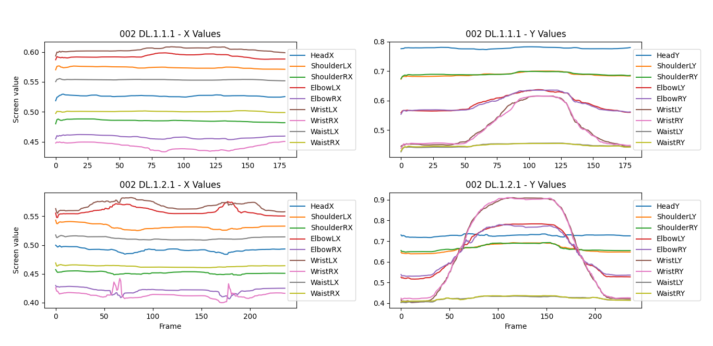
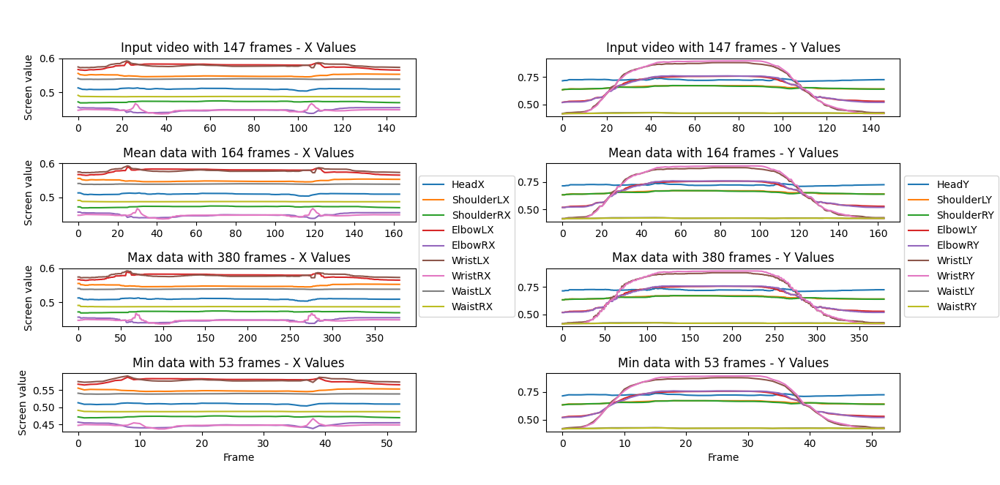

# IOR-Rehab-Thesis
## Introduction
Master Thesis in Computer Science @ Alma Mater Studiorum in collaboration with [Istituto Ortopedico Rizzoli](https://www.ior.it/).

The aim of the project is to develop a multimodal neural network able to automatically predict 5 scores regarding the rehabilitation of patients. Doctors from IOR:
* Recorded patients doing 5 different types of exercises in 2 sessions, each of which with more or less 10 repetitions: the first session was recorded before phisical rehabilitation, the second one after it; 
* Marked 5 scores for each repetition of each session: Goal, Width of movement, Head position, Shoulders position, Trunk position. Each score ranges from 1 to 5, where 5 is the highest;
* Stored data of patients (sex, age, ...)

## 1. Data preparation
### 1.1. Video extractor
I used mediapipe python library inside `video_data_extractor.py` to extract the coordinates of 9 joints for each frame of every video. Then I exported the keypoints in `.csv` format inside `videos_data`. The joints are: nose (head), shoulder (left and right), elbow (left and right), wrist (left and right) and waist (left and right).

### 1.2. Fix a number of frames for each video
Since I will be using timeseriesai, I will need to provide the input in a 3-dimensional array composed by [video samples][features][time sequences]. In order to have a 3D array I will need to have the same time sequences for each video, but they have different durations. I implemented a function that is able to "increase" or "decrease" the frames number creating or deleting frames data.

### 1.3. Target extraction
The next step is to extract the targets from `scores.xlsx`, the file created by the doctors from IOR which contains the 5 marked scores for each repetition, session and patient, using `target_data_extractor.py`.

### 1.4. Data finalization
Since there are some videos without valutation, finalize the dataset by only keeping those videos that have a valutation by doctors with `finalize_dataset.py`.

*Note:* 
* *mediapipe couldn't analyze the video `028 BA.5.1.1.mp4` (probably because of the skin color that is very similar to the background). I deleted from `targets_data/ex5/028 BA DX 5.1.csv` the first line, corresponding to the said video.*
* *There were some valutation of unexistent videos. I removed from some files in `targets_data/` the rows about those non existent videos by hand (1 row from `010 FT DX 5.1.csv`, 1 row from `009 QC DX 1.1.csv` and `010 FT DX 1.2.csv` file)*

## 2. Data visualization
Using `extracted_data_reader.py` we can visualize the data extracted.
* Visualize improvement of a patient in the same repetition between the sessions. In the upper plots we can see X and Y values of the first session, in the bottom plots the X and Y values of the second session. The image example shows the improvement in the first exercise, anterior elevation, and we can clearly see how wrists and elbows go much higher in the second session.  
    

    
    

* Visualize the frame number adjustment. In the upper plots we can see the original X and Y values of the original video, in the following plots we can see the adjusted X and Y values of the adjusted video for the fixed frame number (mean, max and min of all the videos for the fixed exercise)
    

    
    

## 3. Model training

## Libraries used
* [Numpy](https://numpy.org/)
* [Opencv-python](https://pypi.org/project/opencv-python/)
* [Pandas](https://pandas.pydata.org/)
* [Matplotlib](https://matplotlib.org/stable/index.html)
* [Mediapipe](https://pypi.org/project/mediapipe/)